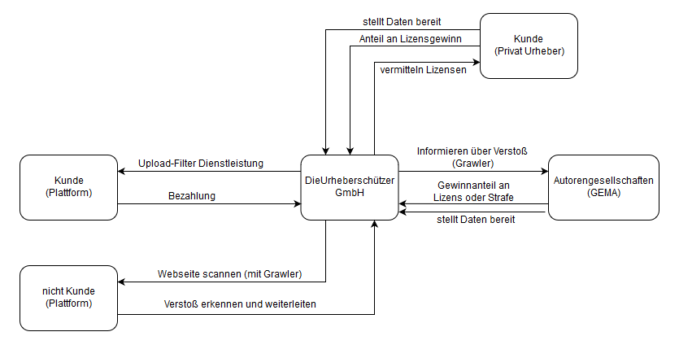

# TheMillionDollarProject

This project will make us rich!

Mit dem kommenden Urheberrechtsgesetzen - unter anderem Artikel 13 - braucht es Uploadfilter um Plattformen vor illegal hochgeladenemß Content zu schützen. Realisiert durch eine Microservice Struktur in der Cloud, soll es Kunden leicht zugänglich und bedienbar gemacht werden.

### Breiche in denen gefiltert wird:
- Literatur
- Video's
- Bilder
- Musik/Audio Spurenzulade

### Stakeholder / Geschäftsmodel
Holder sind zu einem Urheberrechtsorganisationen, dennen wir Melden wann eine Plattform gegen das Urheberrecht verstößt.
Die mittelständigen Plattform Betreiber selbest sind auch unsere Kunden, welchen wir eine sichere Filterung der hochzuladenden Inhalte garantieren. Zudem sollen durch Web-Crawler nicht Customer-Plattformen durchsucht werden und bei Verstoß auf die jeweiligen Lizenzen hingewießen werden.

