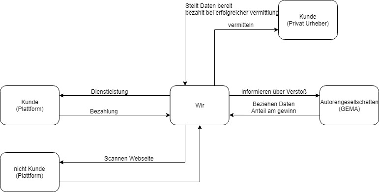

# TheMillionDollarProject

This project will make us rich!

Mit dem kommenden Urheberrechtsgesetzen - unter anderem Artikel 13 - braucht es Uploadfilter um Plattformen vor illegal hochgeladenen Content zu schützen. 

### Breiche in denen gefiltert wird:
- Literatur
- Video's
- Bilder
- Musik/Audio Spurenzulade

### Stakeholder
Holder sind zu einem Urheberrechtsorganisationen, dennen wir Melden wann eine Plattform gegen das Urheberrecht verstößt.
Die mittelständigen Plattform Betreiber selbest sind auch unsere Kunden, welchen wir eine sichere Filterung der hochzuladenden Inhalte garantieren.

### Geschäftsmodel

